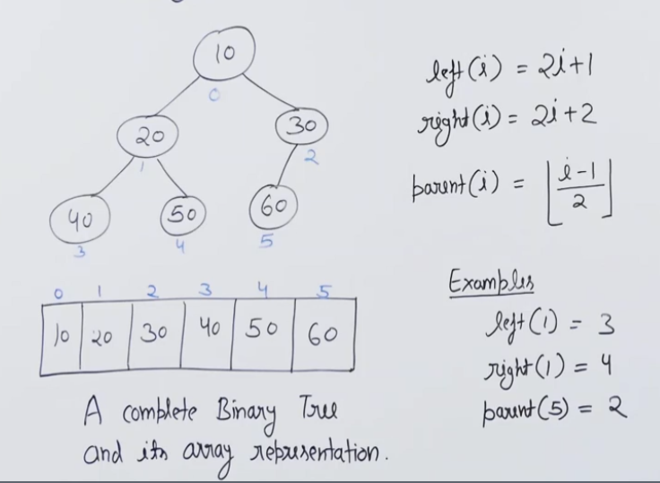

# Heaps

1. ***Application***
    - Heap sort
    - Implement priority queue
     
    
2. ***Properties***
    - Heaps are complete Binary trees
    - They can aso be represented as in form of array
    - If it represented in form of array, following formulas are applicable
        
        leftChild ( i )  =   2*i  + 1
        
        rightChild ( i )  =  2*i + 2
        
        parent ( i )  = floor ( ( i-1 ) / 2 )
        
        
     
        
    
3. ***Types***
    - Min-Heap
        
        Every node is smaller in value than all its descendants
     
        
4. ***Binary heap insert***
    
    While inserting an element we need to take care of above heap properties ( all childs are smaller than parent and tree remains a complete binary tree ).
    
    Steps
    
    - Insert the new element at the end ( as a leaf node ).
    - Now keep swapping the values of parent and child (newly added node) till we reach a point where parent is smaller than pur added node.
    - TC - O (Log(n))
    
    
     
    

1. ***MinHeapify***
    - It is a function executed for a node whose place has to be corrected. Here we get i as the node index as the input.
    - We check if it smaller than its left and right child. If yes do nothing. Else swap the node with smallest of left and right child.
    - Perform the same operation with the it till it becomes smaller than left and right child.
    - TC - O (Log(n)) , SC - O (h)
    
    
    
    Here we MinHeapify(0).
     
    
2. ***Extract min and MinHeapify***
    - We get the top most element in O(1) time.
    - Now we replace this element with the last element of our array (or say tree) and delete this last element.
    - Then we call MinHeapify(0) for the oth index, as our replacement violated the heap structure.
    - TC - O (Log(n)) , SC - O (h)
    
    
     
    
3. ***Decrease Key***
    - Here we replace a existing node with a smaller value.
    - Hence we see that replaced values need to lifted up only (as it was smaller than other).
    - We keep shifting the node with its parent until we get the approriate place.
    - TC - O (Log(n))
    
    
     
    

1. ***Delete Key***
    - Here we will be given a index which needs to be deleted from tree (or say array).
    - We use Decrease key and extarctMin functions combined.
    - First we decrease key that given index with (-infinity) and obviuosly it will be lifted up till root as is the smallest element.
    - Now we extarctMin the smallest element and at last that will also minHeapify the structure.
    - Hece the structure is maintained.
    - TC - O (Log(n))   ( O(Log(n)) + O(Log(n)) )
    
    
     
    
     
    
2. ***Build Heap***
    - We aim to build a heap from the randomly array of size n.
    - We start by picking the rightmost lower internal node and executing minHeapify on it.
    - We get this node by   i = ( (size-2) / 2 ).
    - After this we call minHeapify on every node before it ( i -- ) .
    - It lool like calling mminHeapify on every node so TC should be ~~O(n) * O(Log(n))~~ , But it not
    - TC - O(n) only.
     

1. ***Heap sort***
    - Convert the given array in heap structure ( execute build max or min heap ) and it takes O(n) time.
    - Now ExtractMIn or ExtarctMax as per your need and heapify the index 0.
    - This takes O(Log(n)) time.
    - TC - O(n) * O(Log(n)).
     