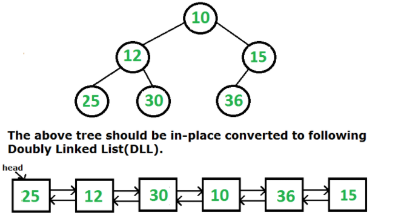

# Trees

1. ***Application***
    1. To represent hierarchical data.
    2. Binary Search Trees.
    3. Binary heap
    4. B and B+ Trees in DBMS 
    
    
2. ***Traversals***
    
    All the below traversals can be performed using recursive and iterative method.
    
    |  |  | Recursive Time | Recursive Space | Iterative Time | Iterative Space |
    | --- | --- | --- | --- | --- | --- |
    | InOrder | left - root - right | O(n)   | O(h)   | O(n)   | O(h)   |
    | PreOrder | root - left - right | O(n)   | O(h)   | O(n)   | O(h)   |
    | PostOrder | left - right - root | O(n)   | O(h)   | O(n)   | O(h)   |
    
    For iterative Solution we need to use stack, which will basically replace the use of call stack in recursion.
    
    Iterative solution steps:
    
    - Use stack to keep track of all the visited nodes. push the root to stack initially
    - The main fundamental point is we will go left till we reach a null point and store all those node in stack and then one by one we will got to right of those stored nodes.
    - Main while loop if ( curr≠NULL || !st.empty() ).
    - Inside it another while loop if( curr≠NULL )
    - Here in second loop we will go to left as much as possible.
    - Out of it we will pop one element from stack and move our curr to right of this popped element.
    - We will use our printing statement according to our need, at appropriate place in this for loop.
     
    
3. ***Height of tree***
    - Recursively go down the tree and add a count whenever you go down a step and keep a check on its max value.
    - TC - O(n),  SC - O(n)
     
    
4. ***Level order traversal*** 
    - Traverse the tree in level order.
    - Use simple queue to store the upcoming nodes and search the tree using a while loop.
    - TC - O(n),  SC - O(n)
     
    
5. ***Level order traversal line by line***
    - use a simple queue once again but here we use a while and a additional for loop inside it to maintain the level one by one, and print them in new line.
    - TC - O(n),  SC - O(n)
     
    
6. ***Different view of Binary tree***
    
    All the below views of a tree can be achieved using different methods
    
    1. Top view
        
        - Here we will use the concept of level order traversal and keep track of distance of every node and push this dis along with node in our queue. At every node we will check if we have encountered a node with same distance previously. If no push this nodes data in our map with its distance, else do nothing and continue. At the end empty this whole map in our answer vector.
        
        - TC - O(n),  SC - O(n)
         
        
    2. Left view
        - Use level order traverasal line by line and store first element.
        - Use inorder traversal with a counter to keep track of level ( root is at level 0 ), whenever a new max level element is found, store it. This is because the left most element is first to encounter at every level.
        - TC - O(n),  SC - O(h)
         
        
    3. Right view
        - Use level order traverasal line by line and store last element.
        - Use inorder traversal where we visit right side before we visit left one, with a counter to keep track of level ( root is at level 0 ), whenever a new max level element is found, store it. This is because the left most element is first to encounter at every level.
        - TC - O(n),  SC - O(h)
         
        
    4. Bottom view
        - Same as top view but instead of updating our map only when we encounter that distance first time, here we will update it every time we encounter that same distance.
        - TC - O(n),  SC - O(n)
         
    
7. ***Check for balanced binary tree***
    1. Naive method
        - use inorder traversal or any other.
        - At every node you are supposed to check if it is balanced or not.
        - For that we will recursively call a height function at every node to check its left and right height.
        
    2. Efficient method
        - Here we will collectively calculate the height and is balanced or not, hence at every node we will not require to calculate height.
        - Our function isBalanced(Node* root) will return an integer. If that is -1 hence your root node is not balanced, else if its positive, its height of tree from that that node.
         
    
8. ***Binary tree to Linked List***
    
    Here we convert binary tree to linked list.
    
    1. Singly Linked list
        
        
        
        In this conversion left child of every node becomes null, and right child points to next node in linked list.
        
        - Here we will basically follow a pre-order concept. As first node is processed and then left and then right childs are processed.
        - A prev pointer will always point to the tail of the latest linked list prepared.
        - Initially if prev is null root is set to prev, else prev→right  is set to curr-root.
        - prev = root, in every iteration.
        - After this we flatten(left childs), and then flatten(right childs).
        - TC - O(n),  SC - O(h)
         
        
    2. Doubly Linked List

        
        
        In this conversion left child of every node points to previous node in LL, and right child points to next node in LL.
        
        - Here we will basically follow a in-order concept. As first left is processed and then curr-node and then right childs are processed.
        - A prev pointer will always point to the tail of the latest linked list prepared.
        - Head is returned from flatten(left child).
        - Initially if prev is null Head is set to root, else root→left = prev and prev→right = root.
        - prev = root, in every iteration.
        - After this we flatten (right childs).
        - TC - O(n),  SC - O(h)
         
    
9. ***Construct Binary tree from different traversals.***
    
    A binary tree can only be constructed using following combinations.
    
    1. inorder + preorder
        - WKT preorder has node - left - right, hence we will pick one by one element from preorder from index 0 to n-1.
        - For every element we select from preorder, we will find that element’s index in inorder. let say it is “i”.
        - All the elements before index i will consist of left childs of our curr node and elements after index i will consist of right childs of our curr node.
        
    2. inorder + postorder
        - The process is almost similar as above, but here we will start from n-1 index of postorder and go till 0th index, as post order is ( left - right - node )
         
    
10. ***Tree traversal in spiral form***
    - Here we will use 2 stacks accordingly to print spiral output.
    - Initially push root to s1.
    - while looping through elements of s1 push its children to s2.
    - same way vice versa with s2.
     

1.  ***Diameter of Tree*** 
    1. Method 1 ( Naive Solution )
        - calculate diameter of left subtree
        - calculate diameter of right subtree
        - calculate 1 + height( left-subtree ) + height( right-subtree )
        - return max of all 3 above.
        - TC - O(n^2)
         
        
    2. Method 2 ( Efficient Solution )
        - Keep a maxDia variable which keeps tracks of maximum diameter so far.
        - util function returns the height of the current node.
        - at every node we will update the maxDia variable according to heights of the subtrees.
        - TC - O(n)
         

1. ***LCA*** 
    1. Method 1
        - Get path to first node in p1 vector.
        - Get path to second node in p2 vector.
        - Compare both the vectors and accordingly return the common ancestor.
        - TC - O(n),  SC - O(h)
         

    2. Method 2
        - TC - O(n),  SC - O(h)
         

1. ***Burn a Binary tree***
    - TC - O(n),  SC - O(h)
     

1. ***Count Nodes in complete binary tree***
    - Naive
        - Simply go throught every node in any order and count them.
        - TC - O(n),  SC - O(h)
         
    
    - Efficient
        - Use the concept of comlpete binary tree.
        - TC - O(Logn * Logn).
         

1. ***Serialise and deserialise binary tree***
    
    A process where we convert a binary tree into array or string in such a way that the tree can be generated back from that array or string.
    
    1. Serialise
        - Converting tree to string
        - Simply traverse the tree in preorder and push the elelments in array. Push -1 where ever you find NULL.
        - TC - O(n),  SC - O(h)
         
        
    2. Deserialise
        - Converting string to tree
        - Simply traverse the above generated preorder array, and start building the tree. If you encounter -1, consider it as a NULL.
        - TC - O(n),  SC - O(h)
         

---

## Properties

|  |  |
| --- | --- |
| Maximum number of node at level X (root at level 0) | 2X |
| Maximum number of nodes of binary tree of height H | 2H  -  1 |
| Minimum height of Binary tree with L leaves | log2(L) + 1 |
| Minimum height of binary tree with N nodes | log(N) |

## Types

1. **Full Binary Tree**
    
    A Binary Tree is a full binary tree if every node has 0 or 2 children 
     
    
2. **Complete Binary Tree**
    
    A Binary Tree is a Complete Binary Tree if all the levels are completely filled except possibly the last level and the last level has all keys as left as possible.
     
    
3. **Perfect Binary Tree**
    
    A Binary tree is a Perfect Binary Tree in which all the internal nodes have two children and all leaf nodes are at the same level.
     
    
4. **Balanced Binary Tree**
    
    A Balanced binary tree, also referred to as a height-balanced binary tree, is defined as a binary tree in which the height of the left and right subtree of any node differ by not more than 1.
     

5. **A degenerate (or pathological) tree**    
    A Tree where every internal node has one child. Such trees are performance-wise same as linked list.
     